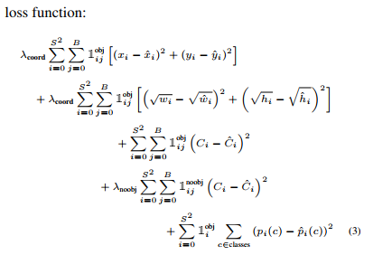
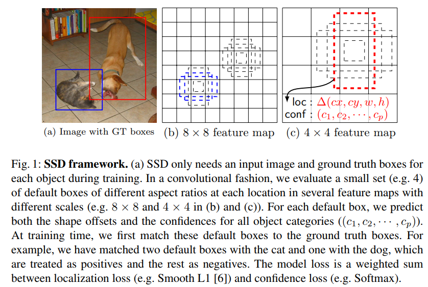

# Object Detection Summary
## 1. SPP-Net
**Spatial Pyramid Pooling in Deep Convolutional Networks for Visual Recognition** [[Paper](https://arxiv.org/pdf/1406.4729.pdf)] [[Code](https://github.com/ShaoqingRen/SPP_net)]: Kaiming He et.al

#### Net structure
Main structure: ZF + Spatial Pyramid Pooling layer

Spatial Pyramid Pooling Layer: SPP是BOW（Bag of Words）模型的扩展，**将图像从粗粒度到细粒度进行划分，然后将局部特征进行整合（在CNN流行之前很常用）。**

SPP-net将最后一层conv层之后的pooling层用SPP层进行替换，在每种粒度输出kM维向量（k：# filter； M：该粒度包含的bin的数量）。其中最粗的粒度只输出一个bin，也就是global pooling, 而global average pooling可以用用于减小模型尺寸，降低过拟合，提高精度。

**特点**：可以接受不同长宽比，不同大小的输入图片，输出固定大小的向量。 

#### Model Training
**Single size training**  
输入：固定224 x 224大小  
conv5 feature map输出：a x a (eg: 13 x 13)  
SPP: n x n bins, 滑动窗池化，win=ceiling(a/n) stride=floor(a/n)  

**Multi-size training** 
输入： 224 x 224和180 x 180 (224 resize 产生)  
由于SPP层输出的大小只与粒度有关与输入无关，所以224和180两种图片输入的模型的各层权重可以完全共享，因此在训练的时候用一个网络训练一个epoch之后保留权重用另一个网络训练一个epoch，如此迭代。

#### SPP Net for object detection
与RCNN相比，不同与RCNN的proposal选择在输入图片上进行，SPP Net在featurem map上进行操作，不需要对每个proposal进行重新的卷积计算，速度提高100倍+（操作与fast RCNN类似）。 

Selective Search 提取2000个proposal，resize图像min(w, h) = s ∈ S = {480， 576， 688， 864， 1200}后提取特征，对每个候选proposal用4层SP（1x1,2x2,3x3,6x6, total 50 bins）pool，输出256*50=12800d向量输入到fc层，最后用SVM分类。正例为bbox，负例为与正例IoU<0.3的box（去掉与其他样本IoU>0.7的负例）

---
## 2. DeepID-Net
**DeepID-Net: Deformable Deep Convolutional Neural Networks for Object Detection** [[Paper](https://arxiv.org/pdf/1412.5661.pdf)]: Xiaoou training  
An extension of R-CNN: box pre-training, cascade on region proposals, deformation layers and context representations
#### Network structure
**method:** SS提取proposal; RCNN剔除可能是背景的proposal；crop bbox的图片输入到DeepID-Net输出各类的confidence（200类）；用计算全图的分类score（1000类）作为contextual信息来优化前面bbox的分类score；平均多个deep model的输出来提高Detection精度；RCNN进行bbox regression。

**def-pooling layer**:conv层输出大小为W x H，C个part detection maps，记Mc为第c个part detection map，Mc的第(i,j)个元素是mc(i,j)。def-pooling层从Mc取一个大小为(2R+1)x(2R+1)，中心为（sx.x, sy.y）的区域，输出如下，大小为（W/sx, H/sy）：

其中mczδx,δy是把第c个part放到deformed position zδx,δy的visual score； ac,n和dc,nδx,δy通过BP学习；Σn=1Nac,ndc,nδx,δy是把part从假定的anchor处（sx.x, sy.y放到zδx,δy的惩罚。 
而当N=1，an=1, d1δx,δy=0 for |δx|, |δy| ≤ k，d1δx,δy = ∞ for |δx|, |δy| > k，此时def-pooling layer相当于max-pooling with kernel size k。 

**优势**：1. 可以替换conv层，学习不同size和semantic meaning的deformation parts；比如高级用大的parts（上肢），中级的用中间级别的part（人头），低级的用小的part（嘴）。2. def-pooling layer可以同时检测多个有相同visual cur的deformable parts（如上图所示）；通过def-pooling layer学习的visual pattern可以在多个class共享。

**contextual modeling**: concatenate 1000-class score as contextual score with 200-class score to form a 1200d feature vector.

**multiple deep models**: models trained in different structures, pretraining schemes, loss functions (hinge loss), adding def-pooling layer or not, doing bbox rejection or not.

---
## 3. YOLO
**You Only Look Once: Unified, Real-Time Object Detection** [[Paper](https://arxiv.org/pdf/1506.02640.pdf)] [[Code](https://github.com/pjreddie/darknet)]: RGB et.al  
Other references: [TensorFlow YOLO object detection on Android](https://github.com/natanielruiz/android-yolo)

**特点**：从全图提取特征来同时预测所有类的所有bbox，允许end-to-end training，检测实时性高。
#### Network structure
**原理**：首先将图片切分成S x S个格子，如果物体的中心在一个格子内，那么这个格子就需要对检测的该物体负责。每个格子预测B个bbox以及这些bbox的confidence score - Pr(Object)\*IOUpredtruth即反映了格子包含物体的可能性以及位置坐标的精度。每个bbox预测值有5个：（x, y, w, h, confidence）；而每个格子预测C个条件类概率（Pr(Classi|Object)。只有当格子包含物体的时候才计算这个概率，并且**计算class的概率每个格子只做一次，与bbox的数量(B)无关**。在test的时候将条件类概率与之前的confidence相乘即可得到每个bbox的每个类的检测概率（这个值包含了预得的测类以及坐标的准确性，如下）。 

在Pascal数据集下S=7， B=2, C=20，所以最后的预测为7x7x(5x2+20)的Tensor。 

**网络结构**：
24 conv + 2 fc; fast version为9 conv + 2 fc。  

#### Model Training
首先用ImageNet 1000 class + 上图前20层+average pooling+fc预训练（top5:88%）**分类**,输入的图片大小为224x224。然后在这基础上加4conv+2fc（weights随机初始化）并且图片输入大小提高到448x448训练 **检测**。其中 **预处理** 根据输入图片的大小normalize bbox的宽和高到0-1，而x,y则基于特定格子参数化到0-1。

最后一层的激活函数是linear activation，其他层为Leaky ReLU: 

每个格子都会预测多个bbox，但是训练的时候我们对应每个物体只想要一个bbox predictor。如果某个predictor的预测值与某个物体真实值之间存在最大IOU，那么这个predictor就是负责这个预测这个物体的。

**Loss function** 

其中，λcoord=5, λnoobj=0.5用于增大bbox预测坐标的loss，减少没有包含物体格子的预测confidence的loss（因为大部分格子木有包含物体）；而为了使小的bbox预测坐标时的偏差比大的bbox时影响更大，对w和h进行了开根处理。liobj表示格子i含有是否物体，有就是1；lijobj表示i个格子中使用第j个bbox predictor是负责预测该物体的（分类误差只有在格子有物体的时候计算，坐标误差只有在predictor是负责预测这个物体的时候计算）。

数据集：VOC2007+VOC2012

#### Inference
98(7x7x2) bbox + NMS

#### Limitation
- 每个格子只有2个bbox，以及只能属于1类，因此集群的小物体很难检
- 预测新的尺寸或者异常长宽比的bbox的坐标能力较差，相比与faster R-CNN，定位误差较大。
- 将大小不同个的bbox的error按一样的方式处理（小bbox的误差对IoU影响较大）

---
## 4. YOLOv2(YOLO9000)
**YOLO9000: Better, Faster, Stronger** [[Paper](https://arxiv.org/pdf/1612.08242.pdf)] [[Code](https://github.com/allanzelener/YAD2K)]

#### Improvement
1). 每层conv后添加 **BN** (Batch Normalization)；

2). **分类** 模型也用448x448的输入图片训练（提高训练输入图像的分辨率），然后fine-tune用于检测模型；

3).**Anchor boxes** 
使用anchor boxes代替conv层后的全连接层预测的bbox并用anchor box来预测class（在yolo中是由每个格子进行预测）和objectiveness（98 bbox in YOLO --> >1000(13x13x9) bbox in YOLOv2)

用k-means clustering代替手动预先确定anchor box的大小(聚类的距离函数为d(box, centroid)=1−IOU(box, centroid)而非euclidean distance)  

4). 使用相对grid cell的位置来预测坐标：将真实bbox bound to 0-1，而将预测值用logistics activation也限制到0-1。其中pw和ph是预设的anchor box的宽和高。

5). 更细粒度的feature来捕获小物体（ **passthrough层** ）：使用最后一层feature map(13x13)的前一层(26x26x512)，将其转成13x13x2048（类似与resnet中identity mapping）并与最后一层concatenate。

6). 由于YOLOv2只包含conv层和pooling层，没有fc层，因此输入 **任意大小** 的图像。每10个batch选择一个新的输入图像大小 - {320, 352, ..., 608}。

7). 用 **Darknet** 代替VGG作为分类模型作为YOLOv2的基础，减少计算量提高速度。在检测的时候用3x3 conv层（1024 filter）+ 1x1 conv层代替Darknet最后的conv层。加一层passthrough层将最后的3x3x512层（feature map:14x14）与最后的3x3x1024层(feature map: 7x7)相连。

8). Hierarchical classification
使用WordTree来预测每个节点的条件概率：比如如果一个物体标记为terrier，那么同时也被标注为dog和mammal。在训练/预测的时候将所有WordTree的中间节点也加入预测的label（VOC：1000-> 1369），然后计算联合概率。

---
## 5. AttentionNet
**AttentionNet: Aggregating Weak Directions for Accurate Object Detection** [[Paper](AttentionNet: Aggregating Weak Directions for Accurate Object Detection)]

---
## 6. DenseBox
**DenseBox: Unifying Landmark Localization with End to End Object Detection** [[Paper](https://arxiv.org/pdf/1509.04874.pdf)] : Baidu

#### model structure
VGG19 前12层conv，conv4-4后面添加up-sampling层，与conv3-4连接叉出两个branch，分别用于预测bbox的left top和bottom right点和是否包含物体的概率：ti = {s, dxt=xi−xt,dyt=yi−yt, dxb=xi−xb,dyb=yi−yb}i(第一个是confidence score，后面的是输出的坐标与真实bbox的距离)。

**loss function**  

 （貌似这个公式是错误的）

#### landmark Localization

 
Llm: L2 loss of predicted value and labels; Lrf与Lcls相同

---
## 7. SSD
**SSD: Single Shot MultiBox Detector** [[Paper](https://arxiv.org/pdf/1512.02325.pdf)] [[Code](https://github.com/weiliu89/caffe/tree/ssd)]

**特点**：用一套预设大小和长宽比的bbox来预测各类的score和box offset（类似于Faster RCNN的anchor box）；**结合不同分辨率的feature map用于处理不同大小的物体**；完全 **没有proposal generation** 和接下去的feature resampling，易于训练。速度快59fps on Titan X with mAP 74.3% on 300x 300 image in VOC2007

#### Model structure
以VGG16作为base，然后添加几层逐渐变小的conv层作为不同尺寸的feature map用于检测模型（**低层感受野比较小适合检测小物体，高层感受野比较大适合检测大物体**）。在各层m x n x p 大小的feature map用3 x 3 x p的kernel来生成类的score或者相对与预设的bbox的坐标offset。

**bbox的默认大小和长宽比** 
对于feature map的每个位置有(c+4)\*k个filter，其中c为class数，k为每个点预设的bbox数，4为box shape offset，所以每个feature map共有(c+4)kmn个输出。

#### Model training
1). 与YOLO和faster RCNN类似的，SSD训练的时候需要首先将ground bbox投射到 **每层** feature map上。
首先需要确定哪些预设的box对ground truth的检测负责：根据预设box挑出IoU（jaccard overlap）最高的ground bbox，然后如果预设的box与其他ground bbox之间IoU大于0.5也进行配对，那么网络就可以对多个重叠的预设bbox都检车出高的分值而非只有IoU最高的那一个。

**Loss**： 

其中N是匹配上的预设bbox的个数。权重α设为1，而xijk={1,0}为第i个预设box与第j个ground bbox在物体k上匹配。

预设的bbox不一定需要与每一层的实际感受野对应，**通过设计一系列预设的bbox使特定的feature map与特定大小的物体相对应。**  
首先每一层feature map的预设bbox的大小计算如下： 

其中，Smin=0.2， Smax=0.9， m指共有m层freature map，即最底层的大小为0.2，最高层的大小为0.9。

而长宽比为ar ∈ {1, 2, 3, 1/2, 1/3}}，bbox的宽wka=Sk*sqrt(ar),bbox的高hka=Sk/sqrt(ar)。
而对ar=1，加一个bbox的Sk'=sqrt(Sk*Sk+1)；而每个bbox的中心为((i+0.5)/|fk|, (j+0.5)/|fk|)，其中fk是第k个feature map的size。

通过这种设计，图1中4x4feature map有匹配上够的预设box，但是在8x8的feature map上就没有。

2). hard negative mining

3). data augmentation
- 使用全图
- 与物体box的IoU ∈ {0.1， 0.3， 0.5， 0.7， 0.9}的局部图
- 随机path

挑选的patch大小从原图的0.1-1，长宽比从0.5-2。然后resize到固定大小，0.5的几率随机水平翻转，以及其他一些photo-metric distortions。

---
## 8. DSSD
**DSSD : Deconvolutional Single Shot Detector** [[Paper](https://arxiv.org/pdf/1701.06659.pdf)]

**特点**：SSD+resnet101 with deconvolutional layer (**获取高等级context**)

#### Model structure
只用resnet101替换vgg16，mAP反而从77.5%降到76.4%，但是进过调整之后的精度能显著提升。 

**prediction module**:在feature map之后使用resnet block后再进行预测，而非SSD中直接在conv层之后添加L2 normalization层进行预测，这样做的检测精度就明显超过VGG16了。 

**Deconvolutional SSD**:为了获取高级的context，在SSD基础上添加了deconv层。（**缺点:训练预测时的处理速度会变慢，没有预训练模型可用**） 

其中，elw product值element-wise product，用于连接原始的conv层和相应的deconv层。

#### Model training
**Loss**: joint localization loss (smooth L1) + confidence loss (softmax)。

由于没有类似RCNN的resampling过程，需要数据增强。

使用kmeans clustering来确定预设box的长宽比（**与YOLO2类似**），发现7个类最合适，添加了比例1.6（1/1.6）。

#### FPS

---
## 9. Inside-Outside Net (ION)
**Inside-Outside Net: Detecting Objects in Context with Skip Pooling and Recurrent Neural Networks** [[Paper](https://arxiv.org/pdf/1512.04143.pdf)]: Microsoft RGB

**特点**:预测的时候使用通过spatial RNN整合了contextual information（ION结构）；在ROI区域用skip pooling提取不同尺度的特征；将这两者连接作为网络的输入。

#### Model Structure

2k ROI from raw image (RCNN) --> conv3,4,5+context feature --> L2 normalization， concatenate， re-scale, dimension reduced (1x1 conv) --> 512x7x7 (**由vgg16决定**)  
此外，由于需要结合多层的feature，需要减少1x1conv层初始weight的大小，使用 **Xavier initialization**

**Context feature with IRNNs**  

RNN输入序列的的4个读取方向：上下左右。这里采用的RNN为 **ReLU RNN**（recurrent weight matrix初始化为 **identity matrix**，梯度可以完全通过BP传递。效果可以和LSMTM一样好，但是内存，计算速度可以提升很多）。（常用的RNN结构为GRU， LSTM， plain tanh recurrent nn）

使用 **1x1 conv** 作为input-to-hidden transition，因为可以被各个方向共享。bias也可以通过这个方式共享然后整合到1x1 conv层中。然后IRNN的输出以4个方向的隐含层依次连接。

IRNN从左到右的update如下，其他方向类似： 

而当将hiden transition matrix固定为单位阵的时候，上式就可以简化为：

在每个方向，平行计算所有独立的行和列而非每次计算一个RNN cell；使用semantic label来regularize IRNN输出，这个时候需要添加一层deconv层（32x32 kernel放大16倍）并crop；经过测试在连接各层输出的时候 **不需要dropout**；在训练RNN的时候bias也是不需要的。

第一个4向IRNN输出的feature map就汇总了每个cell周边的feature，随后的1x1 conv层将这些信息混合并降维。在第二个IRNN后，每个cell的输出与输入与输入相关，因此此时的context feature包含了 **global和local** 的信息，feature随位置而改变。 

